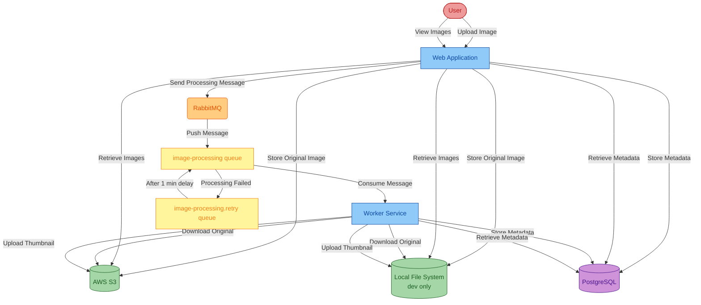

🌐 [Português (Brasil)](README.pt_BR.md) | [Español](README.es.md)

# Asset Manager

This workshop uses GitHub Copilot to assess and upgrade a Java application, plan focused cloud migrations, and containerize its web and worker modules.

**What the modernization Process Will Do:**
Upgrade Java 8 to Java 21 and Spring Boot 2.x to 3.x. Review storage, messaging, database and identity findings separately; execute only the migrations you choose and validate.

## Table of Contents

- [Overview](#overview)
- [Current Architecture](#current-architecture)
- [Run Locally](#run-locally)
- [App Modernization Workshop](#app-modernization-workshop)

## Overview

The [main](https://github.com/copilot-dev-days/appmod-workshop-java/tree/main) branch of the asset-manager project is the original state before being modernized. It is organized as follows:
* AWS S3 for image storage, using password-based authentication (access key/secret key)
* RabbitMQ for message queuing, using password-based authentication
* PostgreSQL database for metadata storage, using password-based authentication

In this workshop, you will use the **GitHub Copilot app modernization** extension to assess, upgrade, and containerize the project.

**Time Estimates:**
Duration varies with the selected findings. The former health-endpoint timing no longer applies. Plan review, code changes and Azure integration testing are separate activities; no fixed total is promised for this revised workshop.
- **Assess Your Java Application**: ~5 minutes
- **Upgrade Runtime & Frameworks**: ~10 minutes
- **Cloud Migration Findings**: Variable
- **Containerize Applications**: ~5 minutes


## Current Architecture

Password-based authentication

## Run Locally

Clone the repository and open the asset-manager folder to run the current project locally:

```bash
git clone https://github.com/copilot-dev-days/appmod-workshop-java.git
cd appmod-workshop-java
```

**Prerequisites**: 
- [JDK 8](https://learn.microsoft.com/en-us/java/openjdk/download#openjdk-8): Required for running the initial application locally.
- [Maven 3.6.0+](https://maven.apache.org/install.html): Required to build the application locally.
- [Docker](https://docs.docker.com/desktop/): Required for running the application locally.

Run the following commands to start the apps locally. This will:
* Use the local file system instead of S3 to store images
* Launch RabbitMQ and PostgreSQL using Docker

Windows:

```batch
scripts\startapp.cmd
```

Linux:

```bash
scripts/startapp.sh
```

To stop, run `stopapp.cmd` or `stopapp.sh` in the `scripts` directory.

## App Modernization Workshop

Ready to modernize this application? Follow the step-by-step workshop guide:

👉 **[Start the Workshop →](WORKSHOP.md)**

The workshop covers:
- Installing GitHub Copilot app modernization
- Assessing your Java application
- Upgrading runtime & frameworks (Java 8 → 21, Spring Boot 2.x → 3.x)
- Plan focused migrations for storage, messaging, databases and identity
- Containerizing applications

